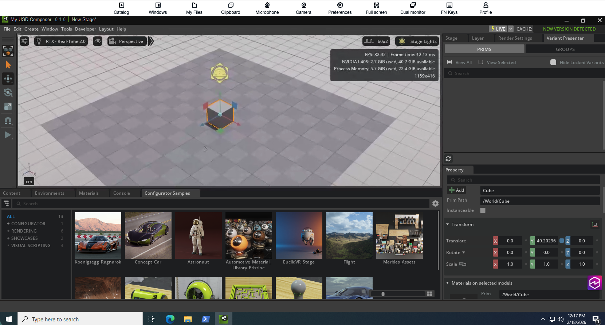
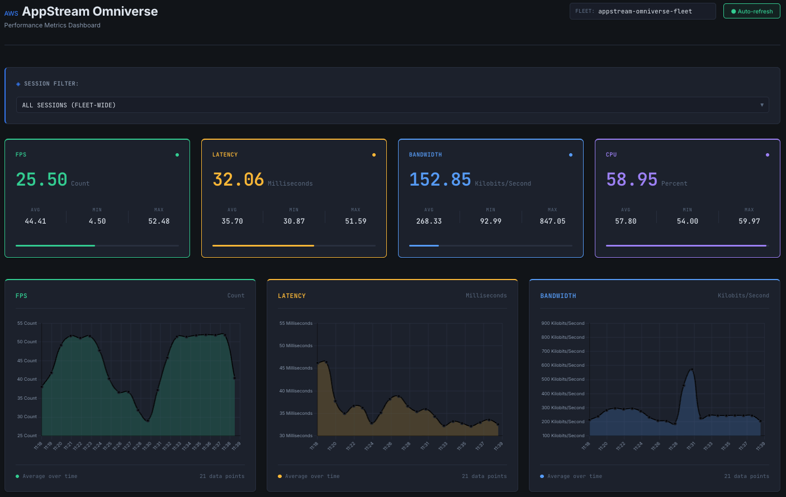

# AppStream Omniverse POC

> ⚠️ **IMPORTANT DISCLAIMER**
>
> This is sample code for educational and demonstration purposes only.
> This code is NOT intended for production use without additional security,
> performance, and reliability considerations.
>
> **Before deploying to production:**
> - Work with your security and legal teams to meet your organizational
>   security, regulatory, and compliance requirements
> - Conduct thorough security reviews and testing
> - Implement appropriate monitoring, logging, and error handling
> - Follow your organization's deployment and change management processes
>
> **Security Notice:** This sample code may not include all security best
> practices required for production environments. Additional security measures
> may be necessary based on your specific use case and regulatory requirements.

AWS AppStream 2.0 streaming NVIDIA Omniverse Kit applications with GPU acceleration (G6e instances, NVIDIA L40S GPUs). Includes a metrics dashboard showing real-time FPS, latency, bandwidth, and CPU utilization from AppStream's built-in CloudWatch metrics.

<table><tr>
<td></td>
<td></td>
</tr></table>

## Architecture


**VPC with private subnets** → **AppStream fleet (G6e GPU instances)** → **Nucleus server (optional)** → **CloudFront dashboard**

Infrastructure deployed via AWS CDK (TypeScript):
- **Backend**: Lambda functions (`metrics-collector`, `session-manager`) serve AppStream metrics via API Gateway with API key authentication
- **Frontend**: React + Vite dashboard (Chart.js) hosted on S3 + CloudFront
- **Metrics**: AppStream built-in CloudWatch metrics (FPS, latency, bandwidth, CPU) — no custom instrumentation required

## Prerequisites

- AWS account with AppStream 2.0 service enabled
- AWS CLI v2 configured with appropriate credentials
- Node.js 18+ and npm
- Python 3.12+ and boto3
- CDK CLI: `npm install -g aws-cdk`

### Request Service Quotas (Do This First)

AppStream GPU instance quotas default to 0. You'll need to request quota increases for:
- **Image builder quota** (L-472DE3D3): minimum 1
- **Fleet instance quota** (L-2C3EA73C): minimum 1

See AWS documentation for requesting quota increases: https://docs.aws.amazon.com/appstream2/latest/developerguide/service-quotas.html

Approval typically takes 1-2 business days. Wait for both quotas to be approved before proceeding.

## Deploy

### Step 0: Configure

  Copy `config.example.json` to `config.json` (`config.json` is git-ignored), then review it and update these settings:

  | Setting | Default | Action |
  |---------|---------|--------|
  | `region` | `eu-central-1` | Set to your target AWS region |
  | `dashboard.adminEmail` | `admin@example.com` | **Must change** — email for Cognito admin user |
  | `nucleus.enabled` | `true` | Set to `false` if you don't need a Nucleus collaboration server |
  | `image.baseAmiId` | `ami-0d58785614c76b704` | Pinned Windows Server 2022 AMI. Auto-validated at build time; falls back to SSM if not found in target region |

  Fleet and stack names are derived from `projectName` (default: `appstream-omniverse`):
  - Fleet: `{projectName}-fleet`
  - Stack: `{projectName}-stack`

  See [Configuration Reference](docs/configuration.md) for all settings.

### Step 1: Deploy Base Infrastructure

```bash
cd web/metrics-dashboard
npm install
npm run build
```

```bash
cd ../../infra  && npm install
cdk bootstrap  # first time only
cdk deploy
```

Deploys VPC, API Gateway + Lambda for metrics, S3 + CloudFront for dashboard, and IAM role for AppStream image import.

### Step 2: Build AppStream Image

```bash
cd ..
python scripts/prepare-ami.py
```

Launches G6e instance from pinned Windows Server 2022 base AMI, installs GRID drivers, creates AMI snapshot, imports to AppStream with g6e validation, and updates `config.json`. Takes 30-45 minutes. This script needs G instance availability, if you get an error wait some minutes/hours and try again.

> **How it works**: CDK uses a two-phase deployment. In Step 1, `customImageName` is empty so only base infrastructure is created. After
  `prepare-ami.py` sets the image name in `config.json`, Step 3 detects it and creates the fleet and stack.

### Step 3: Deploy Fleet

```bash
cd infra && cdk deploy
```

Deploys AppStream fleet (STOPPED, 0 instances) and stack. GPU instances are billed per hour, so the fleet starts empty to avoid unexpected costs.

### Step 4: Start the Fleet

 > **Note**: The commands below use the default `projectName` (`appstream-omniverse`). If you changed it in `config.json`, replace
  `appstream-omniverse-fleet` and `appstream-omniverse-stack` with `{your-project-name}-fleet` and `{your-project-name}-stack`.

Set desired capacity to 1 and start the fleet:

```bash
aws appstream update-fleet \
  --name appstream-omniverse-fleet \
  --compute-capacity DesiredInstances=1 \
  --region eu-central-1 \
  --no-cli-pager \
&& aws appstream start-fleet \
  --name appstream-omniverse-fleet \
  --region eu-central-1
```

Fleet takes 10-15 minutes to reach RUNNING. Check status with:

```bash
aws appstream describe-fleets \
  --names appstream-omniverse-fleet \
  --region eu-central-1 \
  --query "Fleets[0].State"
```

### Platform deploy, verify and destroy commands

The demo platform runs `bash scripts/deploy.sh` as the deploy command, `bash scripts/verify.sh` as the verify command and `bash scripts/destroy.sh` as the destroy command. The CDK stack is deployed by the owner with the steps above, so `deploy.sh` skips `cdk deploy` unless `AGP_DEPLOY_INFRA=1` is set; it prepares `.venv`. `verify.sh` runs `scripts/verify-showcase.sh` when present, checks `.venv/bin/python`, and (with `AGP_DEPLOY_INFRA=1`) checks the stack is `CREATE_COMPLETE`/`UPDATE_COMPLETE`. `destroy.sh` is run only by the platform's tear-down action and, like `deploy.sh`, skips `cdk destroy` (and exits 0 with no records) unless `AGP_DEPLOY_INFRA=1` is set; with it, it stops any running AppStream fleet in the stack, runs `npx cdk destroy --all --force` in `infra/` and prints `REMOVED <stack>` or `LEFTOVER <type> <id>` records (including the AppStream image, prepared AMI, its snapshot and, with Nucleus, the secrets left for manual clean-up); it exits non-zero while a stack still exists.

## Test It

### Create a Streaming Session

Once the fleet is RUNNING, create a streaming URL:

```bash
aws appstream create-streaming-url \
  --stack-name appstream-omniverse-stack \
  --fleet-name appstream-omniverse-fleet \
  --user-id testuser \
  --region eu-central-1
```

Open the returned `StreamingURL` in a browser to start a session.

### Verify GPU Acceleration

In the streaming session:
- Run `nvidia-smi` in command prompt — should show NVIDIA L40S GPU (Ada Lovelace)
- [Kit App Template](https://github.com/NVIDIA-Omniverse/kit-app-template) is pre-installed at `C:\Omniverse\kit-app-template` with desktop shortcut

> Session features (Nucleus auto-config, file persistence): see [Session Features](docs/nucleus.md)

> For Nucleus server setup and multi-user collaboration: see [Nucleus Guide](docs/nucleus.md)

### View Metrics Dashboard

If dashboard is enabled (`monitoring.dashboardEnabled: true` in `config.json`), access via `DashboardUrl` from CDK outputs. You'll need to create a Cognito user first — see [Dashboard Authentication](docs/cognito.md).

## Security Considerations

> ⚠️ **IMPORTANT:** This project is sample code for demonstration and educational
> purposes only. It is NOT intended for production use without additional security
> hardening. Work with your security and legal teams to meet your organizational
> security, regulatory, and compliance requirements before any production deployment.

**Implemented Controls:**
- HTTPS enforced on all public endpoints (CloudFront REDIRECT_TO_HTTPS)
- S3 bucket public access blocked (OAC for CloudFront access only)
- Amazon Cognito authentication for dashboard access (admin-created users only)
- API Gateway protected with Cognito authorizer
- VPC isolation: all compute resources in private subnets
- IAM roles scoped to required actions for Lambda functions and EC2 instances
  (some actions require wildcard resources due to AWS API limitations — review
  and tighten for production use)
- IMDSv2 required on EC2 instances
- Secrets stored in AWS Secrets Manager (auto-generated, no hardcoded values)
- Input validation on API parameters (userId regex pattern)
- API Gateway and S3 access logging enabled
- EBS encryption enabled on Nucleus EC2 instance

**Known Limitations (Demo/POC):**

The following items are acceptable for demo/POC use but **must be addressed
before any production deployment**:

| Item | Current State | Production Action Required |
|------|--------------|---------------------------|
| CORS policy | `Access-Control-Allow-Origin: *` on API Gateway and Lambda responses | Restrict to your CloudFront domain or use a custom domain with Lambda@Edge origin validation |
| Authentication flow | Cognito Implicit Grant (`response_type=token`) | Migrate to Authorization Code Flow + PKCE |
| API Gateway logging | `dataTraceEnabled: true` — request/response bodies logged to CloudWatch | Set to `false` to prevent sensitive data (auth tokens) from being logged |
| WAF | Not attached to CloudFront distribution | Add AWS WAF with AWSManagedRulesCommonRuleSet (requires us-east-1 stack for CLOUDFRONT scope) |
| Nucleus communication | HTTP (no TLS) within VPC | Configure TLS certificates for Nucleus stack, especially for authentication traffic |
| Lambda error responses | `session-manager` and `metrics-collector` return raw exception messages to client | Return generic error messages; log details server-side only |
| AMI builder EBS | `Encrypted: False` in `scripts/prepare-ami.py` | Change to `Encrypted: True` |
| File permissions | `Everyone:(OI)(CI)F` on multiple directories in `userdata.ps1` | Restrict to `PhotonUser` or `BUILTIN\Users` |
| S3 versioning | Not enabled on dashboard and log buckets | Enable `versioned: true` for data recovery |
| Token storage | Frontend stores tokens in `sessionStorage` | Consider BFF pattern or shorter token expiry with CSP headers |
| Download integrity | `userdata.ps1` downloads software without checksum verification | Add SHA256 hash verification for all external downloads |
| API request validation | No API Gateway request validator configured | Add request validators with required parameter schemas |

**Recommendations for Production Use:**
- Add AWS WAF with managed rule sets on CloudFront (requires cross-region us-east-1 stack for CLOUDFRONT scope)
- Migrate from Implicit Grant to Authorization Code Flow + PKCE
- Restrict CORS origins to your specific CloudFront domain
- Set `dataTraceEnabled: false` in API Gateway deploy options
- Enable AWS CloudTrail for full API audit logging
- Configure automatic rotation for Secrets Manager secrets
- Add VPC endpoints to avoid routing traffic through NAT Gateway
- Review and tighten IAM policies — replace `resources: ['*']` with specific ARNs where supported
- Review and tighten security group rules based on your requirements
- Enable GuardDuty for threat detection
- Consider AWS Shield Advanced for DDoS protection
- Add Content Security Policy (CSP) headers via CloudFront response headers policy
- Run `cdk-nag` for automated CDK security checks

## Clean Up

Stop the fleet to avoid charges:

```bash
aws appstream stop-fleet \
  --name appstream-omniverse-fleet \
  --region eu-central-1
```

Wait for fleet to stop, then destroy infrastructure:

```bash
cd infra && cdk destroy
```

**Note**: If Nucleus is enabled, the EC2 instance and EBS volume are deleted with the stack. Secrets Manager secrets enter a 7-day deletion window — delete immediately via the console if needed.

Manually delete (via AWS Console):
- AppStream image: AppStream 2.0 > Images
- Prepared AMI: EC2 > AMIs
- Associated EBS snapshot: EC2 > Snapshots

## On the demo hub

- The fleet is stopped between meetings, so it costs nothing while idle.
- It is started and stopped from the hub through the demo-launcher ([launcher.json](launcher.json)).
- The hourly cost shows on the demo card.
- The streaming URL is created per session; there is no standing link.

See [docs/showcase.md](docs/showcase.md) for the hub content, [launcher.json](launcher.json) for the launcher contract and [docs/deploy-runbook.md](docs/deploy-runbook.md) for the owner's deploy runbook.

## Documentation

- [Configuration Reference](docs/configuration.md) — All config.json settings
- [Troubleshooting Guide](docs/troubleshooting.md) — Common issues and solutions
- [Nucleus Guide](docs/nucleus.md) — Multi-user collaboration setup
- [Dashboard Authentication](docs/cognito.md) — Cognito user management


## Security

See [CONTRIBUTING](CONTRIBUTING.md#security-issue-notifications) for more information.

## License

This library is licensed under the MIT-0 License. See the LICENSE file.

