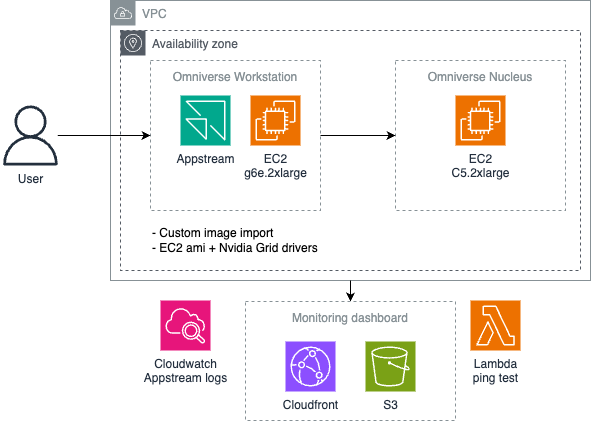
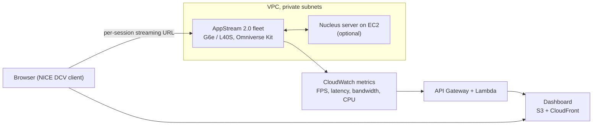

# AppStream Omniverse

tagline: NVIDIA Omniverse Kit streamed from GPU instances in AWS AppStream 2.0, with a live metrics dashboard and optional multi-user collaboration.
tags: Omniverse, AppStream 2.0, GPU streaming, digital twin

## Story

Digital twin and 3D design tools need a workstation-class GPU, but the people who review the models usually only have a laptop and a browser. This demo shows how AWS AppStream 2.0 closes that gap: NVIDIA Omniverse Kit runs on G6e instances (NVIDIA L40S GPUs) inside a private VPC and is streamed to the browser over NICE DCV. The viewer gets an interactive, GPU-rendered scene without installing anything or owning any hardware.

A companion dashboard, hosted on S3 and CloudFront and fed by Lambda through API Gateway, shows what the session is doing in real time: frames per second, latency, bandwidth and CPU utilization. The numbers come from AppStream's built-in CloudWatch metrics, so there is no custom instrumentation on the streaming instance.

Collaboration is optional. When Nucleus is enabled, an Omniverse Nucleus server runs on EC2 in the same VPC and each streaming session is configured to connect to it, so several people can open and edit the same USD scene together.

The GPU fleet is expensive to keep warm, so it stays stopped between meetings and is started from the hub a few minutes before a presentation. Each viewer receives a streaming URL created for their session, valid for a short time, rather than a permanent public link.

Screenshots in this folder are placeholders from the original build until real captures from a running session replace them.

## Architecture

*Omniverse Kit runs on an AppStream 2.0 fleet of G6e instances in private subnets. An optional Nucleus server on EC2 shares the VPC for collaboration. Lambda functions read AppStream CloudWatch metrics and serve them through API Gateway to a React dashboard on S3 and CloudFront.*

